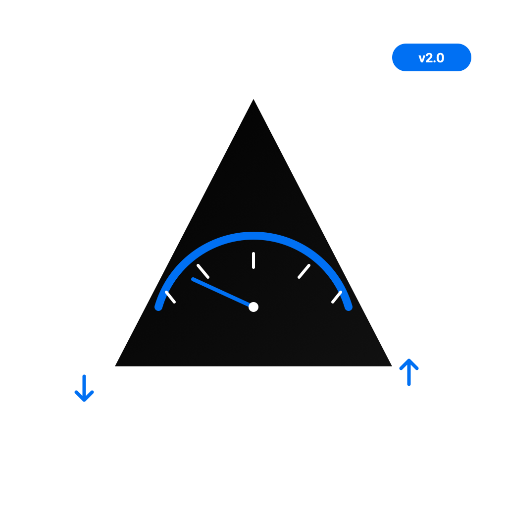

<p align="center">
  
</p>

<h1 align="center">AppThrottler</h1>

<p align="center">
  <strong>macOS 网络测试工具</strong> — 限速 · 故障注入 · 抓包 · HTTP 调试 · iPhone 代理
</p>

<p align="center">
  
  
  
  
  
</p>

---

## 功能特性

### 网络限速
- 为任意运行中的应用设置**下载/上传速度限制**
- **延迟注入** — 0~5000ms，测试超时逻辑
- **丢包模拟** — 0~50%，测试重传和容错
- **10 种内置预设** — 2G / 3G / 4G / 5G / 弱 WiFi / 咖啡厅 / 高铁 / 电梯 / 高延迟 / 严重丢包

### 故障注入
- **DNS 超时** — 阻断 UDP 53，测试 DNS 重试
- **DNS 解析失败** — 返回 NXDOMAIN，测试离线缓存
- **DNS 劫持** — 重定向到 127.0.0.1，测试证书 pinning
- **TCP 连接重置** — 模拟 RST，测试断线重连
- **HTTPS 证书错误** — 阻断 443，测试 SSL 校验

### 抓包 & HTTP 调试
- 基于 **tcpdump** 的进程级抓包，支持 pcap 导出
- **HTTP 请求/响应查看** — 完整 headers、body、状态码、耗时
- **请求重放** — 一键重发请求
- **cURL 导入/导出** — 一键复制或粘贴 cURL 命令
- **会话保存/加载** — JSON 格式，跨会话复用
- **请求 Diff** — 对比两次请求差异
- **13 种资源类型** — Document / XHR / CSS / JS / Image / Font / Media / WebSocket / JSON / XML / Manifest / Text / Other

### 流量监控 & 场景编排
- **实时流量图表** — Swift Charts 面积折线图（macOS 14+）
- **流量统计** — 总量 / 峰值 / 均值
- **自动化场景** — 网络波动 / 断网恢复 / 弱网渐变 / 丢包递增，按时间线自动切换
- **测试配置管理** — 保存/加载/导出测试方案
- **HTML 测试报告** — 一键生成，含限速配置 + 流量统计 + 故障记录

### macOS 原生体验
- **NavigationSplitView** 原生三栏布局
- **Swift Charts** 流量图表
- **毛玻璃 (Glass) 主题** — 深蓝科技 / 暗紫夜空 / 暗绿终端 / 跟随系统
- **ContentUnavailableView** 系统标准空态
- **MenuBar** 原生菜单栏
- **⌘R 快捷键** 刷新进程列表
- **搜索** 原生 `.searchable()` 侧边栏搜索

### CLI 模式 & AI 集成
- 完整命令行接口，支持脚本自动化
- AI Skill 文件，可被 AI agent 直接调用
- JSON 模式，支持管道输入

### iPhone 代理限速
- Mac 端运行 HTTP CONNECT 代理
- iPhone WiFi 设置指向 Mac，所有流量经过限速管道
- 支持按设备 IP 独立限速

---

## 快速开始

### 安装

```bash
# 克隆仓库
git clone https://github.com/YOUR_USERNAME/AppThrottler.git
cd AppThrottler

# 构建
./build.sh

# 运行
open build/AppThrottler.app
```

### 运行要求

- macOS 14.0 (Sonoma) 或更高
- Xcode Command Line Tools（提供 `swiftc`）

```bash
# 安装 Xcode Command Line Tools
xcode-select --install
```

### CLI 使用

```bash
# 列出进程
./cli list

# 限速（需 sudo）
sudo ./cli apply --pid 1234 --download 1000 --latency 200

# 丢包模拟
sudo ./cli apply --pid 1234 --loss 0.1

# 抓包
sudo ./cli capture --pid 1234 --duration 30

# 清除所有限速
sudo ./cli remove-all

# 查看帮助
./cli help
```

---

## 使用指南

### 1. 限速

1. 左侧选择要限速的应用
2. 右侧选择 **手动设置** 或 **网络预设**
3. 配置下载/上传速度、延迟、丢包率
4. 点击 **应用限速** → 输入管理员密码

### 2. 故障注入

1. 选择 **故障注入** Tab
2. 点击要模拟的故障类型
3. 系统会请求管理员权限
4. 停用后自动恢复原始配置

### 3. 抓包

1. 选择 **抓包** Tab
2. 点击 **开始抓包**
3. 实时查看数据包
4. 支持关键字过滤和 pcap 导出

### 4. HTTP 调试

1. 选择 **HTTP 调试** Tab
2. 点击 **开始捕获**
3. 查看 HTTP 请求/响应详情
4. 右键复制 cURL / 重放 / Diff

### 5. iPhone 代理限速

1. 选择 **iPhone 代理** Tab
2. 启用代理服务器
3. iPhone WiFi 设置 → 配置代理 → 手动 → 输入显示的 IP 和端口
4. 在已连接设备列表中对设备限速

---

## 主题

AppThrottler 提供 4 种主题：

| 主题 | 风格 | 毛玻璃 |
|------|------|--------|
| **深蓝科技** | GitHub Dark 风格 | ✅ |
| **暗紫夜空** | Discord 暗紫 | ✅ |
| **暗绿终端** | Matrix/终端风格 | ✅ |
| **跟随系统** | macOS 原生 | ❌ |

在 **设置** Tab 中切换主题。

---

## CLI 完整参考

```bash
# 列出进程
AppThrottler list

# 应用限速
AppThrottler apply --pid <PID> [--download <Kbps>] [--upload <Kbps>] [--latency <ms>] [--loss <0.0-1.0>]

# 清除所有限速
AppThrottler remove-all

# 查看状态
AppThrottler status

# 抓包
AppThrottler capture --pid <PID> [--duration <seconds>]

# JSON 模式
echo '{"action":"list"}' | AppThrottler --json
```

### 常见网络条件速查

| 场景 | download | upload | latency | loss |
|------|----------|--------|---------|------|
| 2G GPRS | 50 Kbps | 20 Kbps | 500ms | 2% |
| 3G | 1 Mbps | 384 Kbps | 200ms | 1% |
| 4G LTE | 10 Mbps | 5 Mbps | 50ms | 0.5% |
| 5G | 100 Mbps | 50 Mbps | 10ms | 0.1% |
| 弱 WiFi | 500 Kbps | 200 Kbps | 300ms | 10% |
| 高铁 | 2 Mbps | 1 Mbps | 500ms | 20% |
| 电梯 | 100 Kbps | 50 Kbps | 1000ms | 30% |

---

## 技术架构

```
┌─────────────────────────────────────────────────────────────┐
│                      AppThrottler                            │
├─────────────────────┬───────────────────────────────────────┤
│   CLI Mode          │         GUI Mode (SwiftUI)            │
│   CLIRunner         │   NavigationSplitView + 11 Tabs       │
├─────────────────────┴───────────────────────────────────────┤
│                      Core Layer                              │
│  ThrottleManager │ FaultInjector │ PacketCapture │ HTTP     │
│  TrafficMonitor  │ ScenarioEngine│ ProxyServer   │ Server   │
├─────────────────────────────────────────────────────────────┤
│                      macOS System Layer                      │
│  dnctl (dummynet) │ pfctl (Packet Filter) │ tcpdump │ lsof  │
│  nettop           │ /etc/hosts           │ NSAppleScript     │
└─────────────────────────────────────────────────────────────┘
```

---

## 构建方式

```bash
# 使用 build.sh
./build.sh

# 使用 Makefile
make build
make run
make clean

# 使用 xcodegen（可选）
brew install xcodegen
xcodegen generate
open AppThrottler.xcodeproj
```

---

## 项目结构

```
AppThrottler/
├── AppThrottler/
│   ├── AppThrottlerApp.swift        # CLI/GUI 双模式入口
│   ├── ContentView.swift            # 主界面（11 个功能 Tab）
│   ├── Theme.swift                  # 主题设计系统（4 套预设 + 毛玻璃）
│   ├── ProcessManager.swift         # 进程枚举
│   ├── ThrottleManager.swift        # 限速核心（dnctl/pfctl）
│   ├── NetworkProfile.swift         # 网络预设模型
│   ├── ScenarioEngine.swift         # 场景编排引擎
│   ├── ProfileManager.swift         # 测试配置管理
│   ├── PacketCaptureManager.swift   # tcpdump 抓包
│   ├── HTTPInspector.swift          # HTTP 调试
│   ├── HTTPInspectorView.swift      # HTTP 调试 UI
│   ├── TrafficMonitor.swift         # 流量监控
│   ├── FaultInjector.swift          # 故障注入
│   ├── ReportGenerator.swift        # 测试报告生成
│   ├── Integrations.swift           # Webhook + AppleScript
│   ├── ServerManager.swift          # REST API Server
│   ├── ProxyServer.swift            # iPhone 代理服务器
│   ├── CLIRunner.swift              # CLI 模式
│   └── Resources/AppIcon.svg        # 图标源文件
├── .agents/skills/appthrottler/
│   └── SKILL.md                     # AI Skill 文件
├── docs/
│   ├── ARCHITECTURE.md              # 架构文档
│   ├── DEVELOPMENT.md               # 开发指南
│   └── CLI.md                       # CLI 参考
├── CLAUDE.md                        # AI 开发指南
├── build.sh                         # 构建脚本
├── Makefile
├── cli                              # CLI 快捷入口
└── project.yml                      # xcodegen 配置
```

---

## 依赖

**零外部依赖** — 全部使用 macOS 系统框架：

- SwiftUI / AppKit / Foundation
- Network.framework（NWListener / NWConnection）
- Charts.framework（macOS 14+）
- CommonCrypto（SHA1 for WebSocket）

系统工具：`dnctl` · `pfctl` · `tcpdump` · `lsof` · `nettop`

---

## 文档

| 文档 | 说明 |
|------|------|
| [CLAUDE.md](CLAUDE.md) | AI 开发指南（项目架构、编码规范、常见陷阱） |
| [docs/ARCHITECTURE.md](docs/ARCHITECTURE.md) | 系统架构图、数据流、类关系 |
| [docs/DEVELOPMENT.md](docs/DEVELOPMENT.md) | 环境配置、构建流程、调试技巧 |
| [docs/CLI.md](docs/CLI.md) | CLI 命令完整参考 |

---

## Contributing

1. Fork 本仓库
2. 创建功能分支 (`git checkout -b feature/amazing-feature`)
3. 提交更改 (`git commit -m 'Add amazing feature'`)
4. 推送到分支 (`git push origin feature/amazing-feature`)
5. 创建 Pull Request

请确保：
- `./build.sh` 编译通过
- 所有新功能有对应的 CLI 命令
- 更新相关文档

---

## License

本项目基于 [MIT License](LICENSE) 开源。

---

## Acknowledgements

- macOS `dnctl` / `pfctl` 流量控制机制
- Swift Charts 框架
- Network.framework
- SF Symbols

---

<p align="center">
  <strong>AppThrottler</strong> — 让网络测试变得简单
</p>
